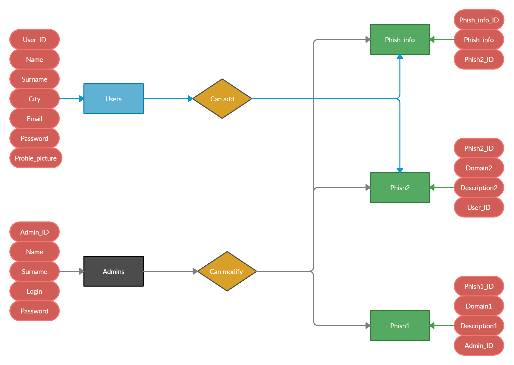

# Phishing
<b> Problem </b> : In the 21st century during quarantine phishing site attacks became very popular
Example of phishing site attack

<b> Solution </b>: Make site forum where users will be write and share information about phishing sites and attacks\

<b> Type of user-interface </b> : Web

## Questions:

* What is phishing?

* Why do I need this site?

* Does this site protect against phishing attacks?

* How can I help this site?

* Where do you get your information?

* How can I provide information about phishing sites?

* I reported a suspected phish, but I don't see it listed. Where is it?

* Who is behind this site?

## Releations-Q:

* What types of phishing attacks exist?

* What sites can have phishing clones?

* Which sites which user added?

* What are the most frequently added sites?

* What are the most frequently added sites for the month?

* How many phishing sites currently exist (in our database)?

* Are there sites from your country?

[Our dataset from Kaggle.com](https://www.kaggle.com/aman9d/phishing-data?select=combined_dataset.csv)

<b>Our UML:</b>

In this <b> ER diagram</b>, we can see a table of users who can add information to the <b> Phish_info </b> and <b> Phish2 </b> tables. <b>Administrators </b> can <b>retrieve</b> and <b>modify</b> data in all three tables. <b>Phish_info</b> is a table describing phishing attacks. <b>Phish2</b> is a table of phishing sites they found.<b> Phish1</b> is a table of phishing sites from the <b> Kaggle </b> ([DB Link](https://www.kaggle.com/aman9d/phishing-data?select=combined_dataset.csv)) database, as well as the sites that can be added by administrators.  And next to the table you can observe their attributes.
